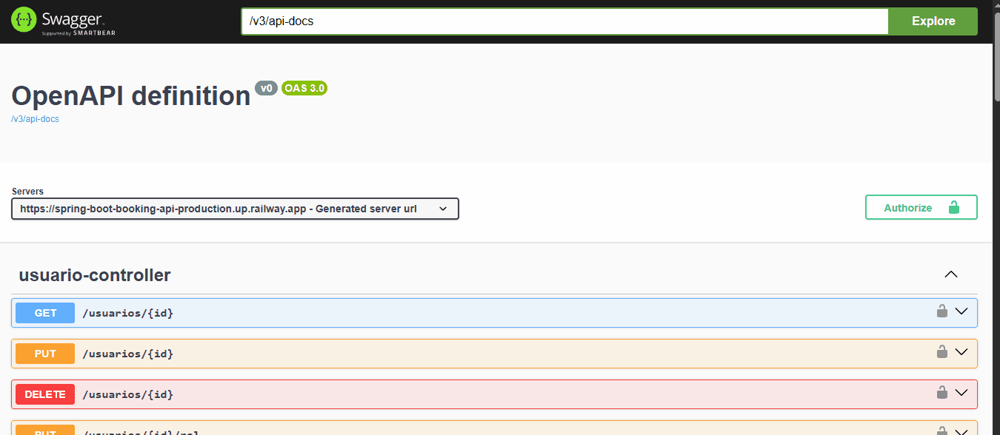

# 📅 Booking API


> **Booking API** es una solución de backend robusta diseñada para la gestión automatizada de reservas, garantizando la integridad de datos y reglas de negocio complejas.

---

### 🏷️ Estado del Proyecto


### 🏅 Insignias


---

## 📋 Índice
1. [Descripción del Proyecto](#-descripción-del-proyecto)
2. [Demostración y Funciones](#-demostración-de-funciones-y-aplicaciones)
3. [Acceso al Proyecto](#-acceso-al-proyecto)
4. [Tecnologías Utilizadas](#-tecnologías-utilizadas)
5. [Instalación y Ejecución](#-instalación-y-ejecución-local)
6. [Personas Desarrolladoras](#-personas-desarrolladoras-del-proyecto)


---

## 📖 Descripción del Proyecto

**Booking API** nace de la necesidad de gestionar reservas de recursos limitados, resolviendo problemas críticos como el **doble booking** (solapamiento de horarios) y la validación de reglas de negocio en tiempo real.

El sistema implementa una arquitectura segura y escalable que protege la integridad de los datos, asegurando que cada reserva cumpla con restricciones estrictas de tiempo y disponibilidad.

### 🧠 Reglas de Negocio Implementadas:
*   **🚫 Cero Solapamientos:** Un algoritmo eficiente verifica que el recurso no esté ocupado en el intervalo solicitado.
*   **⏱️ Duración Controlada:** Las reservas deben tener una duración mínima de **30 minutos** y máxima de **4 horas**.
*   **📅 Anticipación:** Se requiere reservar con al menos **24 horas** de antelación.
*   **🏪 Horarios de Atención:** El sistema valida que la reserva esté dentro del horario operativo (09:00 - 22:00) y rechaza solicitudes para días no laborables (Domingos).

---

## 📱 Demostración de Funciones y Aplicaciones

La API expone sus endpoints a través de una interfaz interactiva con **Swagger UI**, permitiendo probar cada funcionalidad directamente desde el navegador.


### ✅ Happy Path: Creación Exitosa
Flujo completo de autenticación y reserva cuando todos los datos son correctos.



### ❌ Manejo de Errores: Validación de Reglas
Demostración de robustez: el sistema rechaza reservas duplicadas o que violan reglas de negocio.


### Funcionalidades Clave:
*   ✅ **Autenticación JWT:** Login seguro que retorna un token Bearer para acceder a rutas protegidas.
*   ✅ **CRUD de Reservas:** Crear, leer, actualizar y cancelar reservas.
*   ✅ **Validación Automática:** Respuestas claras (400 Bad Request) cuando se violan reglas de negocio.

---

## 🔗 Acceso al Proyecto

Puedes probar la aplicación desplegada en producción:

🚀 **[VER DOCUMENTACIÓN SWAGGER (LIVE)](https://spring-boot-booking-api-production.up.railway.app/swagger-ui/index.html)**

#### 🔐 Credenciales de Prueba (Rol ADMIN):
*   **Email:** `admin@booking.com`
*   **Contraseña:** `12345678`

---

## 🛠️ Tecnologías Utilizadas

Un stack moderno y robusto para asegurar rendimiento y mantenibilidad:

*   **Lenguaje:** [Java 17]
*   **Framework:** [Spring Boot 3.3.9]
*   **Seguridad:** Spring Security + JWT (Stateless)
*   **Base de Datos:** MySQL 8
*   **VERSIONAMIENTO DB:** [Flyway] (Migraciones automáticas)
*   **Contenedores:** Docker & Docker Compose
*   **Deployment:** Railway
*   **Testing:** JUnit 5, Mockito, AssertJ (84% Coverage)

---

## 📦 Instalación y Ejecución Local

Sigue estos pasos para levantar el proyecto en tu entorno local usando Docker.

1.  **Clonar el repositorio:**
    ```bash
    git clone https://github.com/LucasLopez13/spring-boot-booking-api.git
    cd booking-api
    ```

2.  **Ejecutar con Docker Compose:**
    Asegúrate de tener Docker Desktop corriendo.
    ```bash
    docker-compose up -d
    ```
    *Esto levantará la API en el puerto `8080` y la base de datos MySQL en el puerto `3307`.*

3.  **Probar la API:**
    Abre tu navegador y visita: `http://localhost:8080/swagger-ui.html`

---

## 👥 Personas Desarrolladoras del Proyecto

*   **Lucas Federico Lopez** - *Backend Developer* - [GitHub](https://github.com/lucaslopez13)
